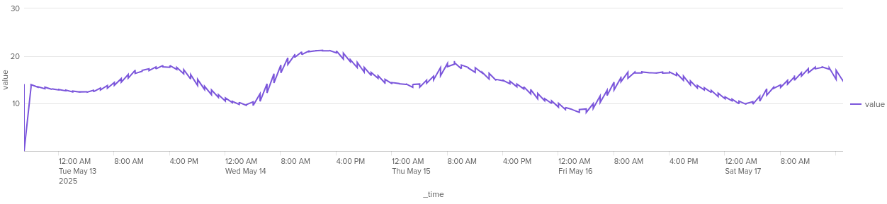

Van valamilyen ciklikus adatom, jelenleg legyenek a hőmérőim otthon.  
Ezek ciklikusak, jó esetben.  
Észlelni akarom, ha a megszokottól eltér.  

  

A probléma változása így nézz ki, látható benne a ciklikusság és a trend is.  
Jelen esetben a ciklusságot a napszak változás okozza a trendet pedig, hogy tavasz van.