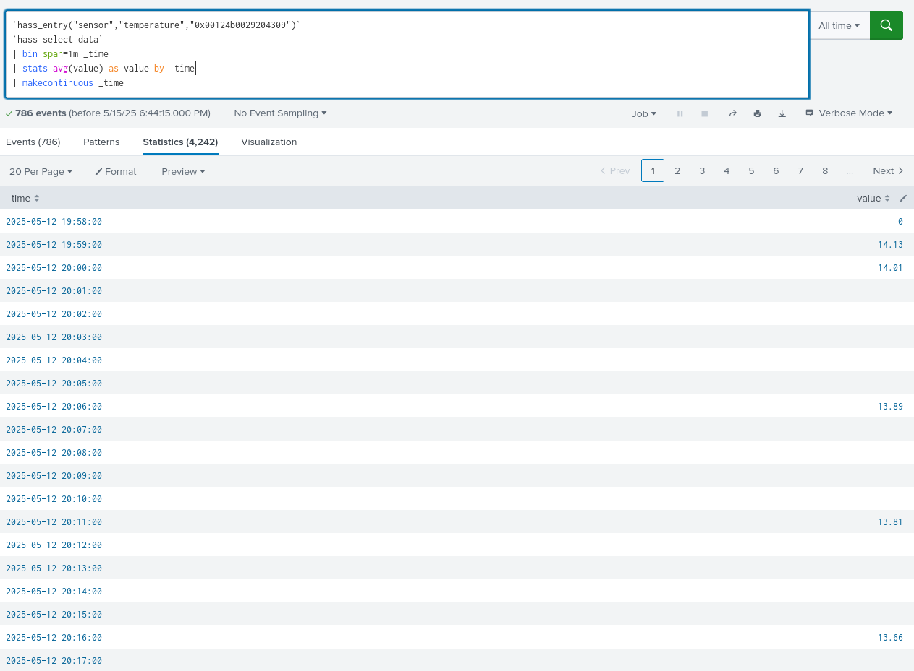
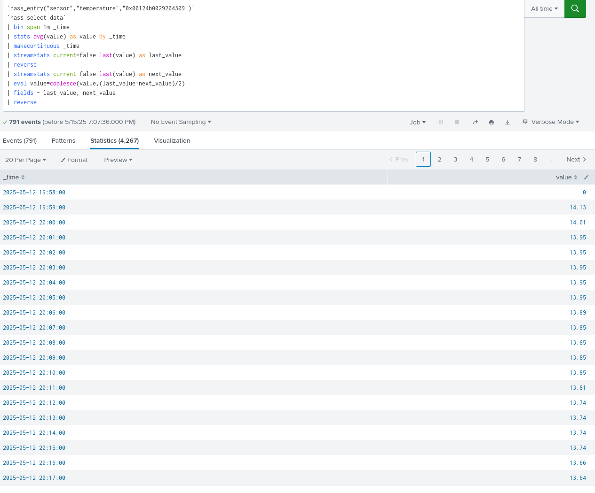

Ez csak szemléltetés.  
  
A null értékek mindig bezavarnak, mert nem számok, így nem tudunk rajtuk értelmesen matematikai műveletek végezni. Ehhez viszonylag sok bevált módszer van, a teljesség igénye nélkül:
- konstans
- előző érték
- következő érték
- valamilyen középérték valamilyen ablak segítségével
- interpolációs technikák, mint spline, lineáris.
Ezeket a feladatnak megfelelően érdemes megválasztani. Jelen esetben a mostani és a következő mérés közötti mértani átlagot választom.  
  