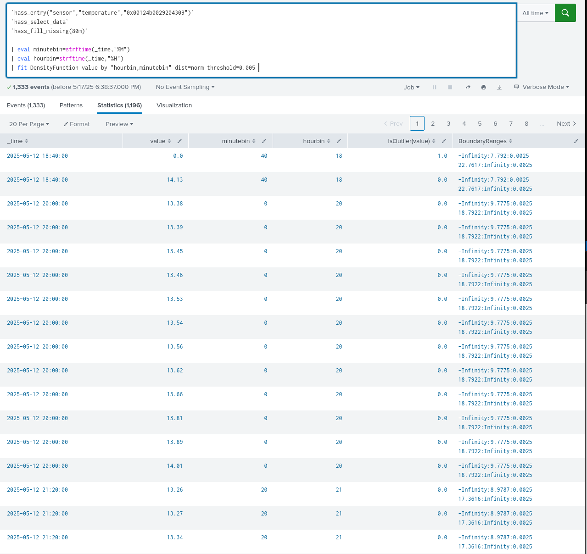

A DensityFunction algoritmust fogjuk használni. Ahhoz, hogy MLTK-ba bekerüljön egy algoritmus a `$SPLUNK_HOME/etc/apps/Splunk_ML_Toolkit/local/algos.conf`[^1] konfigurációs fájlba kell bekerülnie. Most egy beépített funkciót fogunk megnézni, így `$SPLUNK_HOME/etc/apps/Splunk_ML_Toolkit/default/algos.conf` fájlt fogjuk megnézni. Ebben a fájlban csak a stanzát kell dekralálni.

Az ide tartozó python scriptet a `$SPLUNK_HOME/etc/apps/Splunk_ML_Toolkit/bin/algos/DensityFunction.py` fájl írja le. Ennek a célja, hogy a megfelelő modellt kiválasztva, amit lehet automatikusan vagy kézzel kiválasztva a normális, exponenciális, béta és gaussian KDE (Kernel Density Estimation) (Gauss-féle magfüggvény sűrűségbecslés) segítségével. Tudjuk mit csinálunk, így a normálisat fogjuk választani. Ezen felül már előre kezelve van a részletekben lévő frissítés a partial_fit()-en keresztül, így a kezdeti hosszú tanítás után már csak a deltát fogja frissíteni.[^2]  

A következő ábrával lehet jellemezni, amit a következőkben összetörünk.


Elsőnek elemezzük ki ezt a részt:

Most csak a normális eloszlással foglalkozunk.
```py
codecs_manager.add_codec(
            'algos_support.density_function.normal_distribution',
            'NormalDistribution',
            SimpleObjectCodec,
        )
```
Ez egy másik fájlra mutat a `$SPLUNK_HOME/apps/Splunk_ML_Toolkit/bin/algos_support/density_function/normal_distribution.py`[^3]-ra. Ennek a docstringje a következő tartalmazza: `"""Wrapper around scipy.stats.norm"""` tehát nem túl érdekes nekünk. Felhasználja a `scipy.stats.norm` funkciót és Splunk kompatibilissé teszi.

A következő számunkra érdekes része pedig a `fit` ág.

Elsőként nézzük meg, hogy hogyan illeszti az adatot.
```py
def _fit_data(self, distribution, data, mlspl_limits):
        """Fit an instance of ProbabilityDistribution over data.
        Warn if there are too few data points in the data array"""
        min_data_size = int(mlspl_limits.get('min_data_size_to_fit', 50))
        if len(data) < min_data_size and not self._warned_on_few_training_data:
            self._warned_on_few_training_data = True
            self._warn_on_few_training_data()
        # To fix the error of object not having "_exclude_dist" attribute, when partial_fit is used on a smaller dataset and with an earlier version of MLTK (<=5.3.0)
        self._exclude_dist = self._exclude_dist if hasattr(self, '_exclude_dist') else None
        distribution.fit(data.values, self._metric, self._exclude_dist)
        self._warn_on_dist_name_mismatches_threshold(distribution.get_name(), self._threshold)
        self._distance = distribution.distance
```
Ez azt jelenti, hogy úgy kell csoportosítani a lekérésünket, hogy legalább 50 legyen 1 csoportban.[^4] Ezen kívül létezzen egy egyértelmű csoportosítás. Nekünk az óra-perc lesz a megfelelő. Úgy kell szerveznünk az adatunkat, hogy 50 darabos csomagokat hozunk létre. Ebben a pillanatban ez `80m`.


Az eredménye majd a következő formában kerül ki. A fit-nek az eredményét tudjuk szerializálni és az fogja a modellt elő állítani.

A végső parancs az utolsó sorban pedig:
```SPL
| fit DensityFunction value by "hourbin,minutebin" dist=norm threshold=0.005 into app:sensor_temperature_0x00124b0029204309
```

[^1]: https://docs.splunk.com/Documentation/MLApp/5.5.0/API/Registeranalgorithm
[^2]: https://docs.splunk.com/Documentation/MLApp/5.5.0/API/Writealgoclasstemplate
[^3]: {{link to file}}
[^4]: https://docs.splunk.com/Documentation/MLApp/5.5.0/User/Algorithms