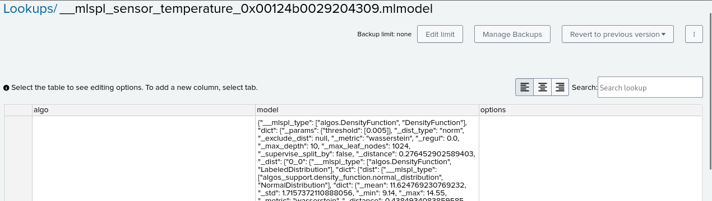
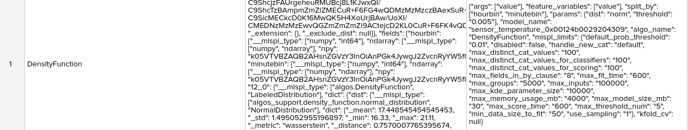
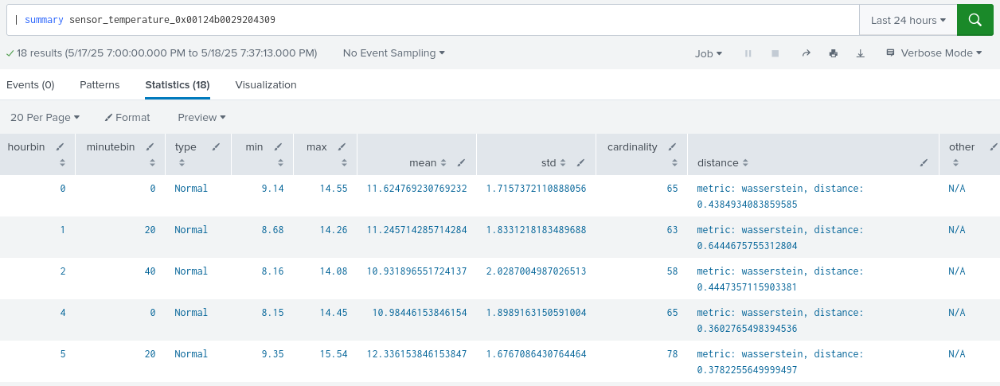

A modellek a Splunk platform szempontjából modellként vannak tárolva. A mi esetünkben `$SPLUNK_HOME/etc/apps/Valkyr_Presentation_MLTK/lookups` mappába. Egy olyan fájlt fog létehozni, aminek a neve __mlspl_{{amit megadtunk az into paramétertban}}.mlmodel lesz.[^1]  

Ez egy saját formátumú szerializálás, amit codecs-nek hívnak az MLSPL fejlesztői. Ez lényegében egy json alapú fájl, amely csv-ként merül mentésre.[^2] Ez egy fura állítás ezért nézzük meg jobban.  
  
  
Ennek a feldolgozásra van egy `| summary` modell név paraméterű parancs.[^3] Ezek mind algoritmus specifikusak.

Key takeaways: egyedi szerializálás, amely valamilyen stratégiát követ, a custom algoritmus fejlesztőjének a feladata karban tartani.  

[^1]: https://docs.splunk.com/Documentation/MLApp/5.5.0/User/Models
[^2]: https://docs.splunk.com/Documentation/MLApp/5.5.0/API/SavingModels
[^3]: https://docs.splunk.com/Documentation/MLApp/5.5.0/User/Customsearchcommands