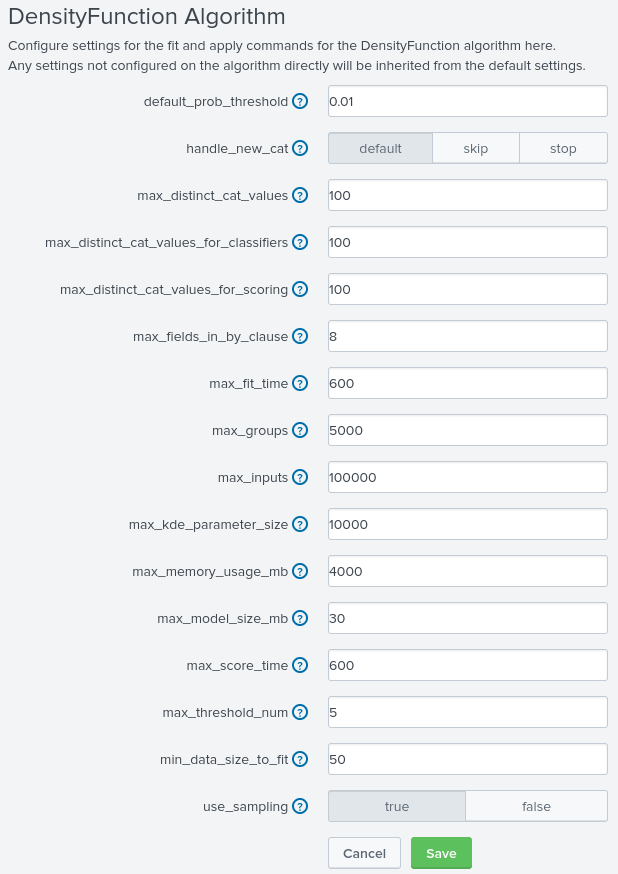

Az alapértelmezett maximum csoport, ami a `| summary` parancsban sorként jelenik meg maximum 1024. Ez egy akadály, amelynek a célja a sebesség garantálása.  

Ezt lehet állítani az MLTK settings-ében, regisztrált modellenként.
  

Általában ezeket a beállítások a `conf` fájlokból szeretjük csinálni, ehhez létezik egy `conf` fájl a `$SPLUNK_HOME/etc/apps/README` mappában, méghozzá a `mlspl.conf.spec` fájl. A képen láthatóak a paraméterek és a kulcsok, a fájlban a stanza alá pontosan ezek kerülnek. Ezek fixált kulcsok, ezekhez kell alkalmazkodni, ezen felül lehet felvenni kulcsokat, amelyek a saját modellünkre specifikusak.[^1]

[^1]: https://docs.splunk.com/Documentation/MLApp/5.5.0/User/Configurefitandapply