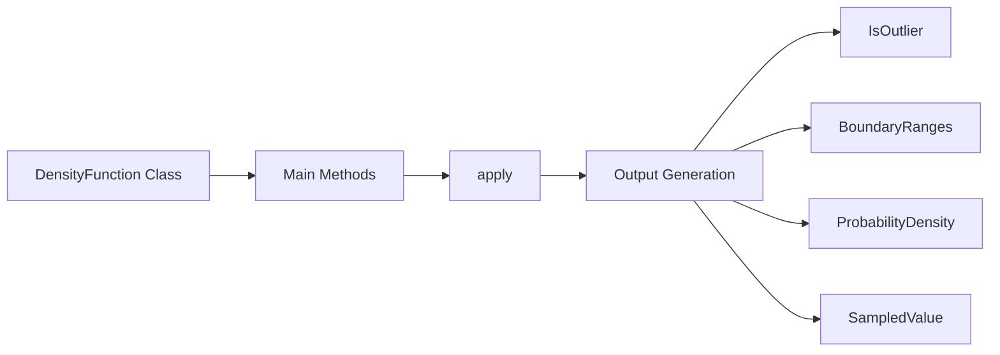
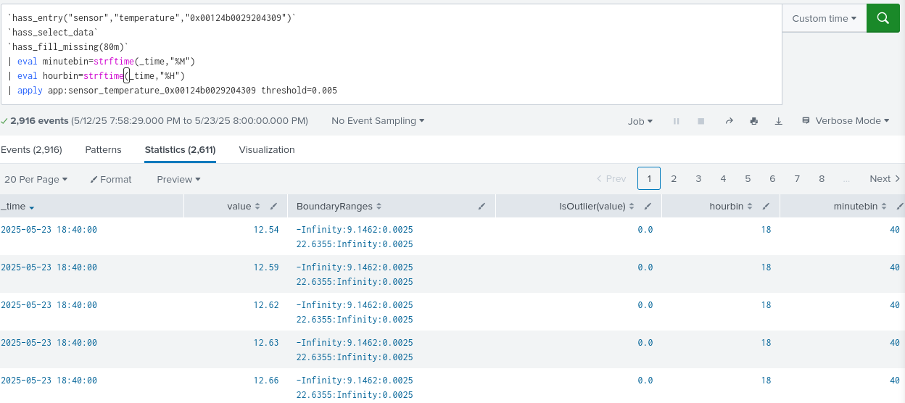
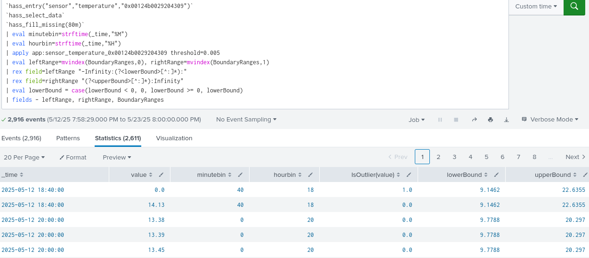

Ha készen van a modellünk, akkor használni akarjuk, erre az `| apply`[^1] parancs van. Ez streaming parancsként fut, tehát nem feltétlenül a search head-en fut a parancs, ezzel jelentősen növelheti a sebességet. Minden modellnek egyedileg kell megvalósítania az `apply` funkciót, hogy az MLTK megtudja hívni[^2].  

Térjünk vissza az ábránkhoz.  

  
Ezt az ágat futtatjuk le. Nézzük meg az eredményét.  
  
Ez így annyira nem használható, dolgozzuk fel.
  

Ezzel készen van egy modellünk és használtuk. Ahogyan a képen látható már az outliereket meg is találja.

---
IDE KELL MÉG RAJZ ARRÓL, HOGY ILLESZTEK NORMÁLIS ELOSZLÁST, MI ELFOGADOTT ÉS MI NEM

[^1]: https://docs.splunk.com/Documentation/MLApp/5.5.0/User/Understandfitandapply
[^2]: https://docs.splunk.com/Documentation/MLApp/5.5.0/API/Writeanalgorithmclass