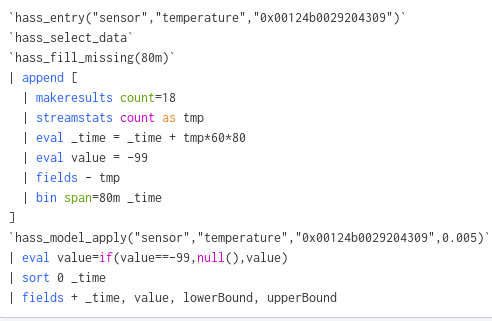

Ahhoz, hogy konkrét haszna legyen egy ilyen eszköznek érdemes valamilyen vizualizációt csinálnunk hozzá.

Mivel ennyit dolgoztunk, így az előrejelzés elkészítése a modell felhasználásával könnyen tud menni.  
Csak egy kis varázslat kell hozzá, ha nincs predict fejlesztve, már pedig ez nem egy előrejelző algoritmus, ez a perezentáció céljából lett így választva.  
  

Így a következő állapotot tudjuk vizualizálni egyelőre.
