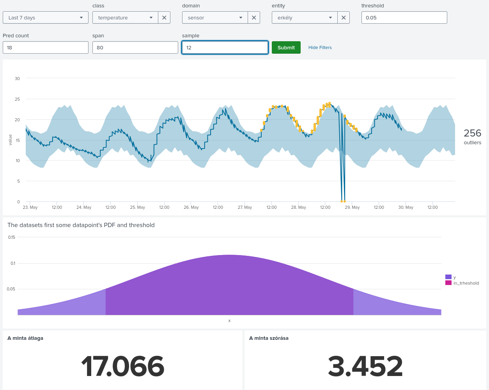

A normális eloszlás sűrűségfüggvénye: $\frac{1}{\sigma \sqrt{2 \pi}} \dot e^{- \frac{(x - \mu)^2}{2 \sigma^2}}$ ezt felhasználva tudunk előállítani vizualizáció arra vonatkozóan, hogy mit csinálunk a háttérben.  

Most vegyük feljebb a thresholdot.  
  
Két dolog változott:
1. A felső ábrán ami a riasztásainkat vizualizálja, ott a vastag világos kék valamivel keskenyebb lett.
2. A thresholdban lévő elfogadott tartomány csökkent.

Más szavakkal élve a konfidencia intervallumot csökkentettük.