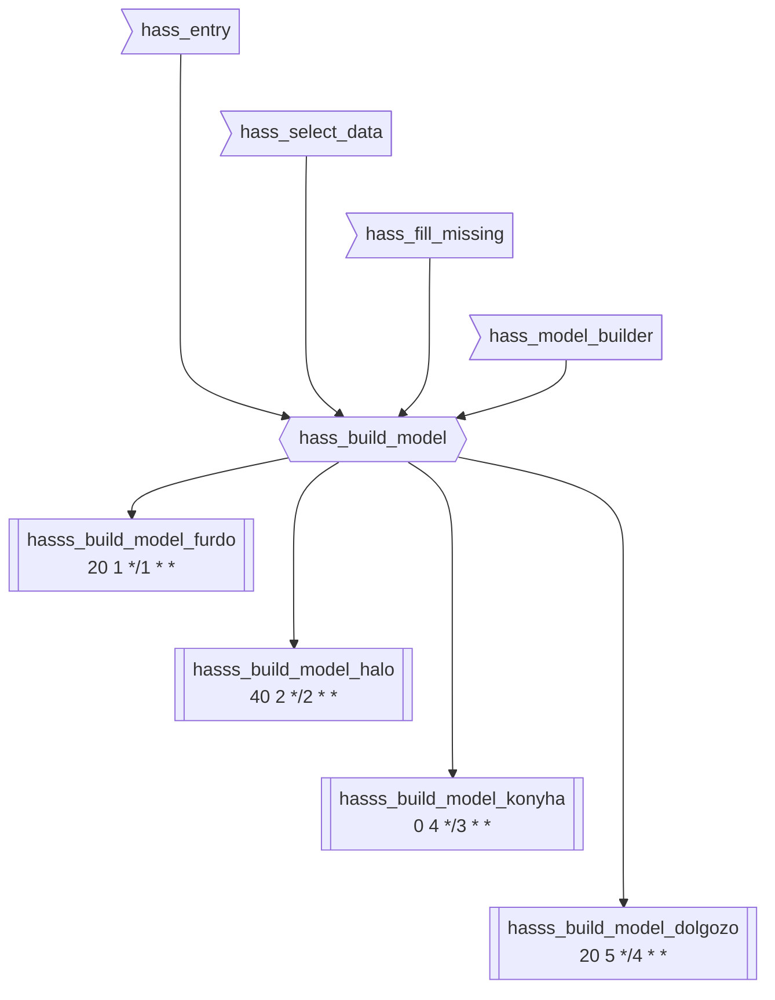
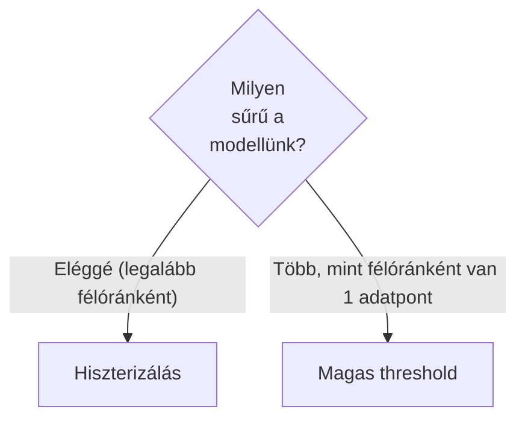
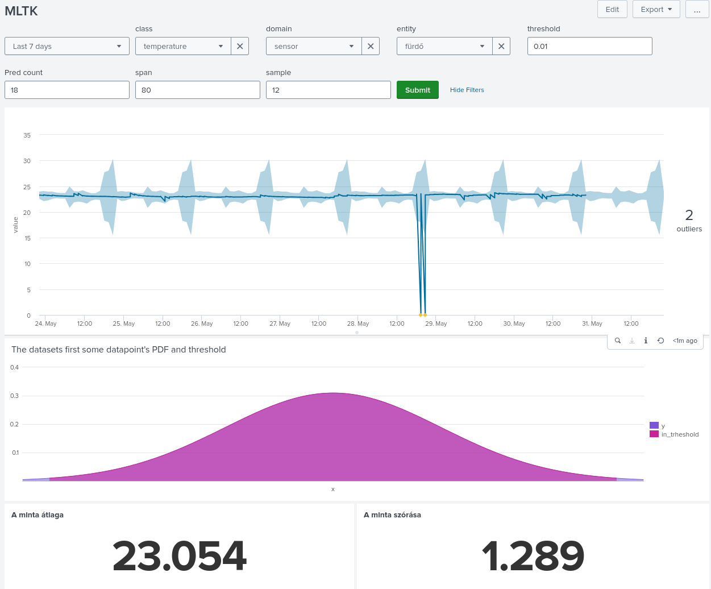

Ahhoz, hogy tudjuk használni modellt kell építeni, majd azt fogjuk tudni hasznosítani.

Felhasználjuk, hogy
```conf
[hass_build_model]
search = `hass_entry("$domain$","$class$","$entity$")`\
`hass_select_data`\
`hass_fill_missing($span$m)`\
`hass_model_builder("$domain$","$class$","$entity$",$threshold$)`
```

Így tudunk csinálni ennek analógiájára

```conf
[hasss_build_model_furdo]
cron_schedule = 20 1 */1 * *
search = | savedsearch hass_build_model domain=sensor class=temperature entity=0x00124b001f918e68 threshold=0.005 span=80
enableSched = 1
schedule_window = auto

[hasss_build_model_halo]
cron_schedule = 40 2 */2 * *
search = | savedsearch hass_build_model domain=sensor class=temperature entity=0x00124b002919761f threshold=0.005 span=80
enableSched = 1
schedule_window = auto

[hasss_build_model_konyha]
cron_schedule = 0 4 */3 * *
search = | savedsearch hass_build_model domain=sensor class=temperature entity=0x00124b00291976c4 threshold=0.005 span=80
enableSched = 1
schedule_window = auto

[hasss_build_model_dolgozo]
cron_schedule = 20 5 */4 * *
search = | savedsearch hass_build_model domain=sensor class=temperature entity=0x00124b0029197748 threshold=0.005 span=80
enableSched = 1
schedule_window = auto
```

A következő macro-k vannak benne:

```conf
[hass_entry(3)]
args = domain, class, entity
definition = index = "hass"\
AND domain="$domain$"\
AND attributes.device_class="$class$"\
AND entity_id="$entity$*"

[hass_select_data]
definition = | fields _time, value\
| fields - _raw\
| table _time, value

[hass_fill_missing(1)]
args = span
definition = | bin span=$span$ _time\
| where value!="unavailable" \
| stats values(value) as value by _time \
| makecontinuous _time\
| streamstats current=false last(value) as last_value\
| reverse\
| streamstats current=false last(value) as next_value\
| eval value=coalesce(value,(last_value+next_value)/2)\
| fields - last_value, next_value\
| reverse \
| mvexpand value

[hass_model_builder(4)]
args = domain, class, entity, threshold
definition = | eval minutebin=strftime(_time,"%M") \
| eval hourbin=strftime(_time,"%H") \
| fit DensityFunction value by "hourbin,minutebin" dist=norm threshold=$threshold$ into app:$domain$_$class$_$entity$
```



Az építés után riasztásokat is akarunk. Ekkor két utunk van az egyik, hogy sziszterizálással (ha találunk 1 hibásat, megszámoljuk/követjük például streamstats-al), ekkor használhatunk kisebb thresholdot.  
A mi esetünkben 80 percenként van elég adatunk, hogy ezt a módszert tudjuk alkalmazni, ezért a threshold épp elég szűkre vételével tudjuk beállítani.



  

Ezt felhasználva létrehozzuk a riasztásokat
