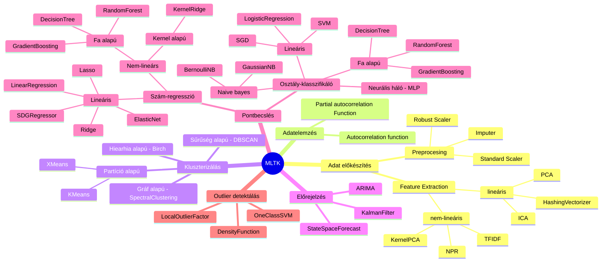
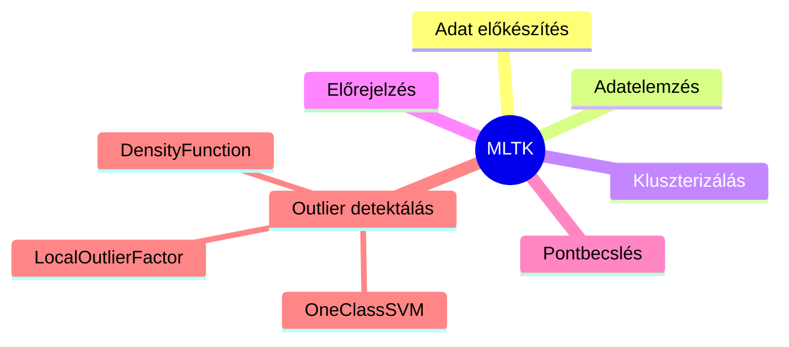
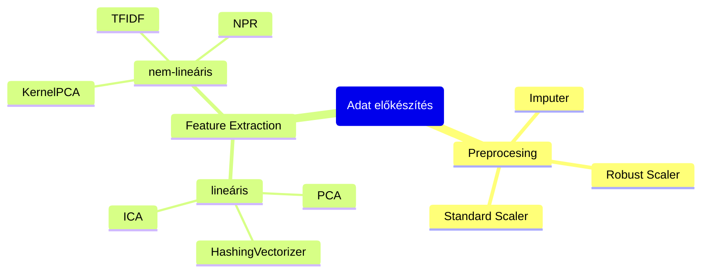
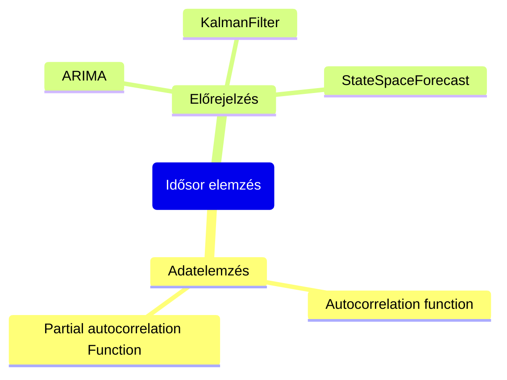
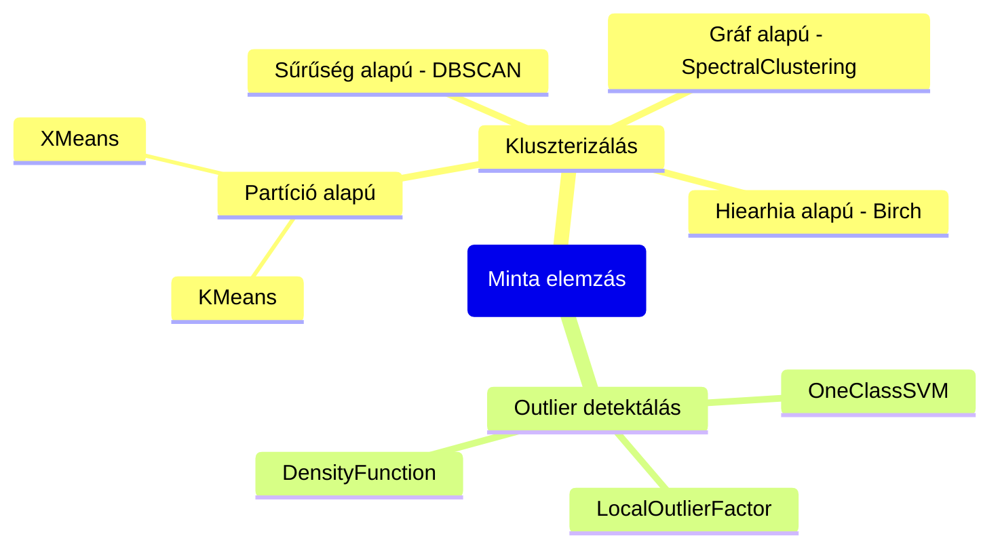
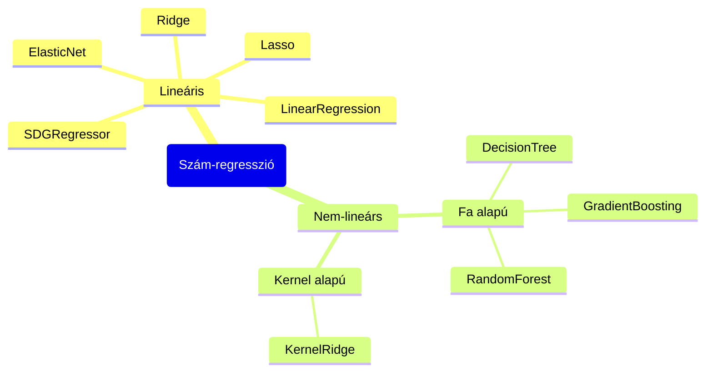
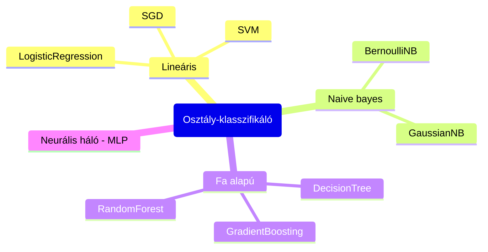

Alapvetően - egy kivétellel az MLTK shallow learning algoritmusokat hoz a Splunkba. A következő ábra összefoglalja a fő céljait.

Az első lépés az az adatelőkészítése, hogy a machine algoritmust tudjuk használni. Ezt rendszerint egyéb SPL parancsokkal érdemes csinálni, viszont valamennyi gyakran használt, algoritmust a kezünkbe ad.  

Nekünk SPL-lel egy explicit feladatunk, hogy a nem lineáris módszereket kiváltsuk adat transzformációval, ez nem mindig lehetséges. Az ár, amit ezért fizetünk horribilis RAM használat.  

Adatelemzésre autokorrelációs eszközöket ad az MLTK, ezek első sorban az idősoros becslések megkönnyítésére és tesztelésére valóak.  

A klasszikus idősor elemzési stack-et valósítja meg, ahogyan az eddig bemutatott példában láthattuk, hogy az egyéb algoritmusokkal is tudjuk őket elemezni, a mi célunknak ezek nem voltak megfelelőek, hisz nem rámutatni akartunk, hogy a múlt alapján valószínűleg ez fog történni, hanem arra akartunk rámutatni, hogy a múlt alapján ez a megszokott.
Iparban más előrejelző modellek általában deep-learning alapúak és hatalmas mennyiségű adaton, eszméletlen idő alatt tanulnak, így előre tanított modelleket használnánk hozzá, mint a meta prophetje vagy a salesforce egyéb modelljei.  

A következő blokk, amelyről beszélni kéne azok az algoritmusok, amelyek képesek mintákat kiemelni a megmutatott adatokból.

Az általunk használt outlier detkroként címkézett DesintyFunction modell is ide tartozik, ezek gyakran használt algoritmusok, más modellek alapköveiként is.  

Az utolsó csomag pedig a statisztika svájci bicskája, a pont becslés. Szigorúan vett értelemben az előző csomag is ide tartozik. Ekkor a célunk a múlt alapján valahány pontot előre jelezni, ezeknek az eredményeit már teljesen öntanuló módszerekbe is bele tudjuk rakni, mint a Kálmán filter.  

Természetesen ilyen létezik klasszifikációs algoritmusokra is.

Ezek között található az egyetlen MLTK-ban megvalósított deep learning algoritmus.