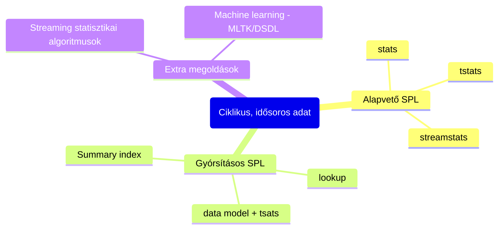

Az említett problémára pár lehetséges helyes megoldás:

Az alapvető probléma a kézenfekvő SPL és gyorsításokkal lévő ötlettel, hogy a múltba visszamenőleg az adatokat felkell olvasnunk és újra és újra átnéznünk, amely gyakori ellenőrzésnél eléggé pazarló.  
A streaming statisztikai módszerek hatékonyak, de ha új ismereteink lesznek időbe telnek, amíg beépülnek.  
Machine learning módszerek viszont megadják a lehetőséget, hogy mindegyiknek az előnyös tulajdonságát egyesítse, cserébe plusz komplexitást hoz be.  
Ebből következik, hogy lehetséges a modellt mindig csak az új ismeretekkel bővíteni, mindig csak kis részét, mindig csak az új adatokra futtatni és ezt már bejáratott open source eszközkkel, Splunk által supportált konnektorral tehetjük.